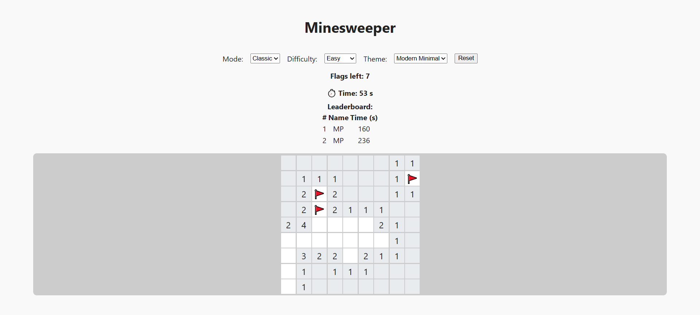
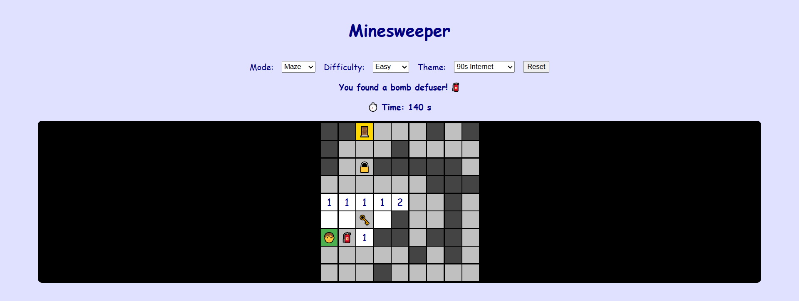

## Screenshots

> _Replace the image files and paths below with your own screenshots!_

### Classic Minesweeper (Modern Minimal Theme)

### Maze/Adventure Mode (90s Internet Theme)

### High Contrast Theme

To add your own screenshots:
1. Take screenshots of your app in different modes/themes.
2. Save them as PNG or JPG files in a new folder: `docs/screenshots/`.
3. Update the image paths above if needed.

---

## FAQ

**Q: How do I change the board size or difficulty?**  
A: Use the "Difficulty" dropdown in the UI. You can also customize the logic in `web-app/game.js` for more options.

**Q: How do I switch themes?**  
A: Use the "Theme" dropdown in the UI. The app supports Modern Minimal, 90s Internet, and High Contrast themes.

**Q: How do I play Maze/Adventure mode?**  
A: Select "Maze" from the "Mode" dropdown. Reveal cells to move, collect keys and defusers from chests, unlock doors, and reach the exit.

**Q: How is the first click always safe?**  
A: The board is regenerated if your first click would reveal a mine or a non-empty cell.

**Q: Where is my leaderboard stored?**  
A: Leaderboard times are saved in your browser's local storage, per difficulty.

**Q: How do I run the tests?**  
A: Run `npm test` in your project directory. See the "Running Tests" section above.

**Q: How do I generate API documentation?**  
A: Run `npx jsdoc web-app/game.js web-app/mazeGame.js`. The output will be in the `docs/` folder.

**Q: Can I play with just the keyboard?**  
A: Yes! Use Tab to focus cells, Enter/Space to reveal, and "F" to flag.

**Q: How do I add more themes or features?**  
A: Extend the theme definitions in `public/app.js` and add corresponding CSS in `public/style.css`.

--- 