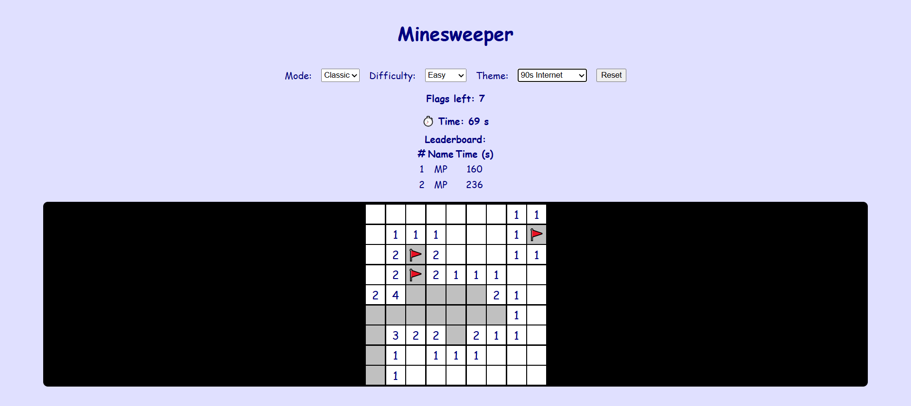
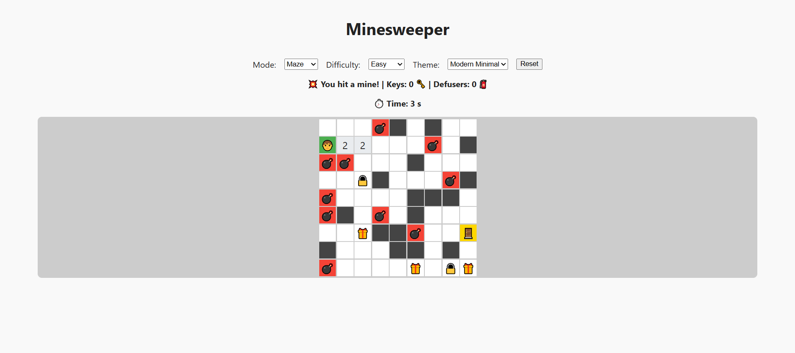
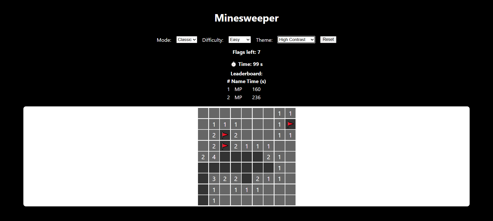

# Minesweeper Web App

A modern, accessible, and fully-featured Minesweeper game with advanced gameplay modes, theming, and a clean web interface. Built for coursework, this project demonstrates pure functional game logic, a well-documented API, comprehensive unit tests, and a responsive, accessible UI.

## Features

- **Classic Minesweeper**: Play the traditional game with customizable board sizes and difficulty levels.
- **Maze/Adventure Mode**: Navigate a randomly generated maze with Minesweeper logic. Reveal cells to move, collect keys and defusers from chests, unlock doors, and reach the exit.
- **Themes**: Choose from Modern Minimal, 90s Internet, and High Contrast themes for accessibility and style.
- **Accessibility**: Fully keyboard-accessible, high-contrast mode, and semantic HTML for screen readers.
- **First Click Safe**: The first cell you reveal is always safe.
- **Timer & Leaderboard**: Track your best times locally for each difficulty.
- **Pure Functional Logic**: All game logic is implemented as pure functions for reliability and testability.
- **Comprehensive Unit Tests**: Mocha-based tests for both classic and maze modes.
- **API Documentation**: JSDoc comments throughout the logic modules.

## Getting Started

### Prerequisites

- [Node.js](https://nodejs.org/) (v14+ recommended)
- [npm](https://www.npmjs.com/)

### Installation

1. Clone the repository:
   ```sh
   git clone https://github.com/Computing-2-Submissions-2024-25/c2-LoneRabbit
   cd minesweeper-webapp
   ```
2. Install dependencies:
   ```sh
   npm install
   ```

### Running the App

Start the local development server:
```sh
node server.js
```
Then open [http://localhost:3000](http://localhost:3000) in your browser.

### Running Tests

Unit tests are written with Mocha and can be run with:
```sh
npm test
```
Tests cover all core game logic, including win/loss conditions, flagging, recursive reveals, maze generation, and inventory mechanics.

## Project Structure

```
minesweeper-webapp/
  public/           # Static assets and main UI (index.html, style.css, app.js)
  web-app/          # Pure JS modules for game logic and tests
    game.js         # Classic Minesweeper logic (pure functions, JSDoc)
    mazeGame.js     # Maze/Adventure mode logic (pure functions, JSDoc)
    tests/          # Mocha test suites for both modes
  server.js         # Express server for local development
  package.json      # Project metadata and dependencies
```

- **public/app.js**: Main UI logic, event handling, and rendering.
- **web-app/game.js**: Pure functional Minesweeper logic (classic mode).
- **web-app/mazeGame.js**: Pure functional Maze/Adventure mode logic.
- **web-app/tests/**: Mocha test suites for both modules.

## Game Modes

### Classic Minesweeper

- Custom board sizes and mine counts.
- Three difficulty levels: Easy, Medium, Hard.
- Flagging, recursive reveal, and win/loss detection.

### Maze/Adventure Mode

- Randomly generated maze with a guaranteed solvable path.
- Player must reveal cells to move; can only move to revealed, non-mine cells.
- Chests (with keys or bomb defusers), locked doors, and inventory tracking.
- Reach the exit to win; hitting a mine ends the game.
- All mines are revealed on loss.

---

## How to Play

### Classic Minesweeper

**Objective**: Clear all non-mine cells without detonating any mines.

**Gameplay**:
1. **Left-click** or **Enter/Space** to reveal a cell
2. **Right-click** or **F key** to flag/unflag a suspected mine
3. Numbers show how many mines are adjacent to that cell
4. Empty cells automatically reveal adjacent cells
5. Flag all mines and reveal all safe cells to win

**Difficulty Levels**:
- **Easy**: 9×9 grid with 10 mines
- **Medium**: 16×16 grid with 40 mines  
- **Hard**: 16×30 grid with 99 mines

### Maze/Adventure Mode

**Objective**: Navigate from your starting position to the exit while avoiding mines.

**Gameplay**:
1. **Left-click** to reveal cells (you can only move to revealed, non-mine cells)
2. **Double-click** on adjacent revealed cells to move there
3. **Arrow keys** to move in four directions
4. **D key** to use a bomb defuser on adjacent mines
5. Collect keys from chests to unlock doors
6. Use defusers to safely clear mines
7. Reach the exit to win

**Special Elements**:
- 🧑 **Player**: Your starting position
- 🚪 **Exit**: Your goal (golden door)
- 🎁 **Chests**: Contain keys or bomb defusers
- 🔒 **Locked Doors**: Require keys to unlock
- 💣 **Mines**: End the game if hit
- 🧯 **Defusers**: Can safely clear mines

### Keyboard Accessibility

**Classic Mode**:
- **Tab**: Navigate between cells
- **Enter** or **Space**: Reveal selected cell
- **F**: Flag/unflag selected cell
- **Arrow keys**: Move between cells

**Maze Mode**:
- **Arrow keys**: Move player in four directions
- **D**: Use bomb defuser on adjacent mine
- **Tab**: Navigate between cells (for revealing)
- **Enter** or **Space**: Reveal selected cell
- **F**: Flag selected cell

**General Controls**:
- **R** or **Reset button**: Start new game
- **Theme dropdown**: Switch between visual themes
- **Difficulty dropdown**: Change game difficulty
- **Mode dropdown**: Switch between Classic and Maze modes

### Accessibility Features

- **High Contrast Theme**: Designed for visually impaired users
- **Keyboard Navigation**: Full game control without mouse
- **Screen Reader Support**: Semantic HTML and ARIA labels
- **Color Blind Friendly**: Multiple themes with distinct visual patterns
- **Responsive Design**: Works on mobile and desktop devices

### Tips & Strategies

**Classic Mode**:
- Start with corners and edges (fewer adjacent cells)
- Use flags to mark suspected mines
- Look for patterns in revealed numbers
- The first click is always safe

**Maze Mode**:
- Reveal cells systematically around your position
- Save defusers for critical path mines
- Collect keys before encountering doors
- Plan your route to the exit

---

## Theming & Accessibility

- **Modern Minimal**: Clean, neutral colors.
- **90s Internet**: Nostalgic, playful palette and fonts.
- **High Contrast**: For visually impaired users.
- Fully keyboard-accessible (tab, enter/space to reveal, F to flag).
- Responsive design for mobile and desktop.

## API & Documentation

All game logic is implemented as pure functions and documented with JSDoc. See `web-app/game.js` and `web-app/mazeGame.js` for API details.

To generate HTML documentation (requires [JSDoc](https://jsdoc.app/)):
```sh
npx jsdoc web-app/game.js web-app/mazeGame.js
```

## Screenshots


### Classic Minesweeper (Modern Minimal Theme)


### Classic Minesweeper (90s Theme)


### Maze/Adventure Mode (Modern Minimal Theme)


### Maze/Adventure Mode (90s Internet Theme)


### High Contrast Theme



---